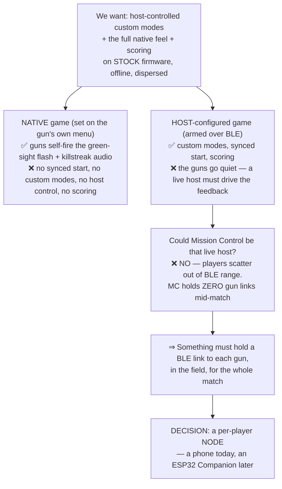
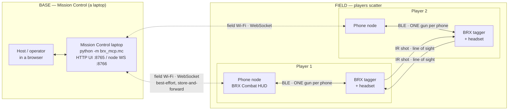
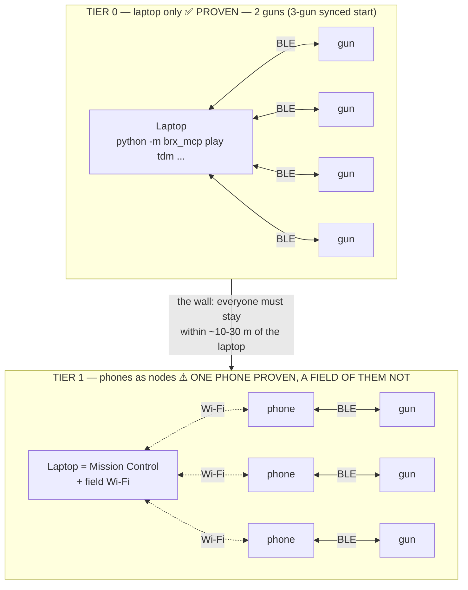
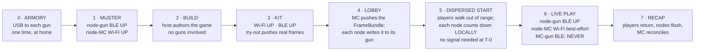
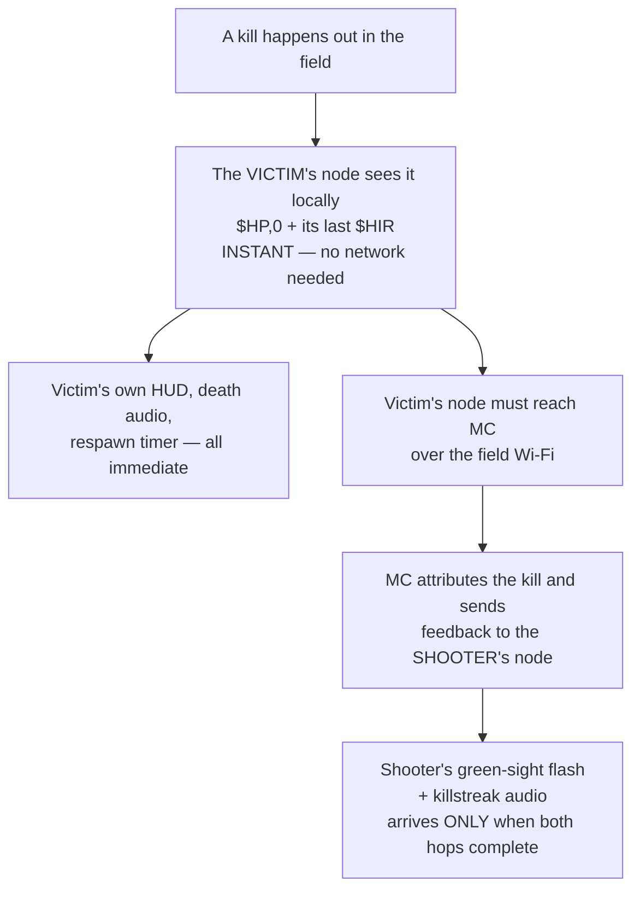

# How Open BRX is wired — topology, limits, and why

**Audience: anyone new to this project** — an owner deciding whether to use it, or a contributor
deciding where their change belongs. Read this before the spec.

Open BRX is not one program. It is **three tiers of hardware that never all talk to each other at
once**, and almost every design decision in this repo follows from that. This page draws the
connections, states the limit on each one, and cites where the fact comes from.

> **Legend:** ✅ proven on real hardware · ⚠ partly proven · ⬜ specified and software-tested, **not**
> yet run on hardware. The distinction is load-bearing here — see §7.

> **Short answer, if you own taggers and a laptop:** you can play **today**, in one room, with the
> laptop driving the guns directly over BLE — that path is proven on hardware (§3, Tier 0). What you
> cannot yet do is take it to a real field with phones, because that half has only ever been run one
> phone at a time at a bench (§7).

---

## 1. The squeeze — why the architecture looks like this

Every awkward part of this system comes from one trap, set out in
[`adr/0001`](adr/0001-companion-rider-architecture.md) §Context:

The four facts that set the trap, each non-negotiable:

1. **Stock firmware is never modified.** Everything is done over the documented BLE serial
   protocol. (Project hard rule; `CLAUDE.md`.)
2. **The gun is host-blind about its own kills.** It keeps no host-readable game state and emits no
   shooter-side kill event. A kill is visible only from the **victim** (`$HP,0` plus that victim's
   last `$HIR`). So the scorekeeper can never be the gun. (`protocol/brx-protocol.md` §7n; ADR-0001.)
3. **Native feel and host control are mutually exclusive** — until you drive the feel yourself.
   The green-sight flash and killstreak audio *are* BLE-drivable (`$SFLASH` + the token-4 `$PLAY`
   slot, §7o), **but only by a host connected to that gun at the instant of the kill**.
4. **The field is offline and dispersed.** Mission Control is a stationary base. Its BLE reaches the
   guns only when players are *at* the base — setup and recap. (ADR-0001 §Context 5.)

---

## 2. Match-time topology

**Solid line = must hold. Dashed line = allowed to drop.** That is the whole resilience model: the
BLE link rides the player and must survive the match; the Wi-Fi link may come and go, and events
queue locally until it returns.

**There is deliberately no line from Mission Control to any gun during play.**

### Every link, and what limits it

| Link | Transport | Limit | Source |
|---|---|---|---|
| Gun ↔ headset | vendor link | headset must be present or the gun drops BLE entirely | `brx-protocol.md` §7r |
| **Node (phone) ↔ gun** | **BLE** | **one gun per node**, link must hold all match | ADR-0001; `spec/node.md` |
| Node ↔ Mission Control | Wi-Fi (WebSocket) | best-effort; buffered when down | `spec/net.md`; ADR-0002 |
| Operator ↔ Mission Control | HTTP, localhost or LAN | `:8765` UI, `:8766` node socket | `field-runbook-mc.md` §0 |
| Gun → gun | **IR**, line of sight | the only player-to-player channel | `protocol/brx-ir-protocol.md` |
| Laptop ↔ gun | BLE | **setup and recap only** — never during play | ADR-0001 §Context 5 |
| Laptop ↔ gun | **USB** | one-time armory setup per gun | `spec/README.md` phase 0 |

### Counting limits

| Thing | Limit | Why |
|---|---|---|
| Guns per BLE radio | **~5–7 links at ~10–30 m** | ADR-0002 §Context 1 |
| Guns per phone node | **exactly 1** | ADR-0001; the link rides one player |
| Players per game | **63** | `$PSET` player id, 1–63; 0 reserved |
| Native teams | **4** | `$TID` is masked to 2 bits |

> ⚠️ **A documented disagreement.** ADR-0002 says one BLE central holds "~5–7 links at ~10–30 m";
> `build-tiers.md` Tier 0 says "one radio reaches ~7–10 taggers". Both are estimates, neither is
> cited to a measurement, and nobody has run the test. Treat 5–7 as the planning number.

---

## 3. Two deployment shapes — and the wall between them

This is the most important practical distinction in the project, and the one most likely to be
misread.

**Tier 0 is real today.** A full Team Deathmatch ran end to end on two real taggers on 2026-08-25 —
scoring, respawn, frag limit, correct winner, BLE holding the whole match
(`experiment-log.md`, "FIRST LIVE M0 GAME"). Three-gun synchronised start is also hardware-proven
(FOLLOWUPS B10). The constraint is that **everyone stays in the laptop's BLE range** — a room, a
yard, a small field.

**Tier 1 is what buys you a real field**, and it is the thinly-tested half. One phone through the
whole chain — phone ↔ MC ↔ gun — has run at the bench. A *field* of them, on a router-hosted LAN,
with a dispersed timed start, has not. See §7 for the line-by-line.

---

## 4. Which links are up, phase by phase

The phase names below are this project's own vocabulary, defined in
[`spec/README.md`](spec/README.md) §3: **armory** = one-time USB setup per gun · **muster** =
everyone connects and reports ready · **kit** = assigning names, teams and weapons · **lobby** =
the config is pushed to each gun · a **FrameBundle** is that per-player bundle of gun commands.

The interesting phase is **5**. The match starts on a wall-clock time agreed in advance, and each
node counts itself down. No "go" signal crosses the field, because at T-0 there may be no network
left to cross it.

---

## 5. The limitation this shape creates

Everything a player experiences *about themselves* is instant and offline. Everything about
**someone else** needs two network hops.

So on a large field, with patchy coverage: **you always know you died. You may not learn you got a
kill until you walk back into range.** The spec calls this "coverage honesty"
([`spec/README.md`](spec/README.md) §3, A4.8) and it is a deliberate trade, not a bug.

Final results are never wrong, only late — kills live in the *victims'* reports, so a scoreboard is
provisional until every node has flushed.

---

## 6. What happens when things break

| Failure | What happens | Where |
|---|---|---|
| Field Wi-Fi drops | Nodes keep playing. Events queue locally and flush on return. | `spec/net.md` |
| BLE drops mid-match | The node re-probes on reconnect; **config survives a BLE drop** ✅ | `brx-protocol.md` §7r |
| Gun is power-cycled | Config is **wiped**; a zeroed `$LCD` is the node's tell to re-push ✅ | `brx-protocol.md` §7r |
| Phone dies | That player is out. One phone = one gun = one node, with no failover. | ADR-0001 |
| Node never returns | The recap stays provisional — that player's kills are missing. | `spec/README.md` §3 |

---

## 7. Proven vs. specified — read this before trusting a diagram

| Element | Status |
|---|---|
| Laptop ↔ gun BLE, full game, scoring, respawn, winner | ✅ 2 guns, 2026-08-25 |
| Synchronised start across guns | ✅ 3 guns (FOLLOWUPS B10) |
| Config survives BLE drop; power-cycle wipes it | ✅ bench |
| One phone ↔ one gun over BLE | ✅ single-gun bench |
| **One** phone ↔ MC ↔ gun, at the bench | ✅ real phone→MC→gun sessions, 2026-08-25/26 (`HANDOFF.md` §Where the project stands; `experiment-log.md`) |
| **More than one phone** on the MC LAN | ⬜ never run |
| A router-hosted field LAN (rather than the bench) | ⬜ never run |
| A dispersed, time-synced start on a real field | ⬜ never run |
| The **local timed end** | ⬜ "not yet exercised" (`spec/node.md` §3.9) |
| Store-and-forward recovery across a real outage | ⬜ never run |
| Hold-across-disperse for 5 min | ⚠ only 2 min done (`brx-protocol.md` §7r) |
| iOS BLE on a locked phone; phone auto-rejoin | ⬜ never run |
| The ESP32 Companion and the Utility Box | ⬜ **do not exist** — every link involving them is paper |

> ⚠️ **Other docs summarise this differently** — `HANDOFF.md` calls the phone path "field-verified"
> (while noting soak/scale certification is still open), whereas `README.md` and
> [`field-runbook-mc.md`](field-runbook-mc.md) have called it unverified. Both are describing the same
> thing at different resolutions. The table above is the resolution to trust: **one phone through the
> whole chain is real; a field full of them is not.**

**A green test suite is not a working field.** That distinction is stated in FOLLOWUPS B15 in the
project's own words: "a green test ≠ 'works on real guns' — that's earned on the bench."

---

## Where to go next

- **You own guns and want to play** → [`build-tiers.md`](build-tiers.md) for what each budget buys,
  then the `brx-mcp` quickstart in the [root README](../README.md).
- **You're running a match** → [`field-runbook-mc.md`](field-runbook-mc.md).
- **You're changing the code** → [`spec/README.md`](spec/README.md), then
  [`spec/contracts.md`](spec/contracts.md).
- **You want to know why, not what** → the three ADRs in [`adr/`](adr/).
