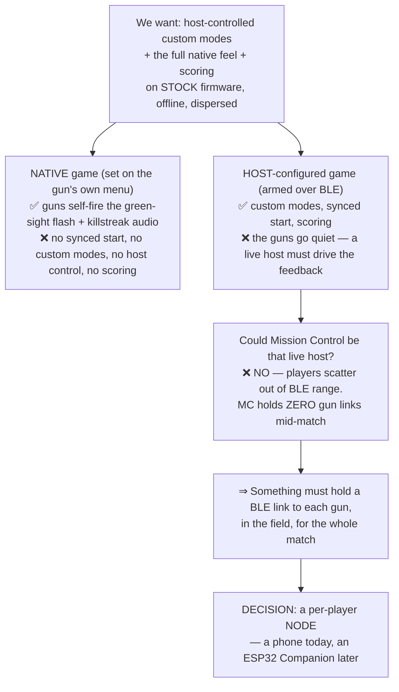
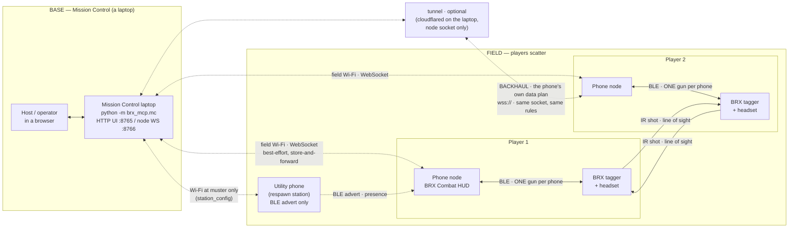
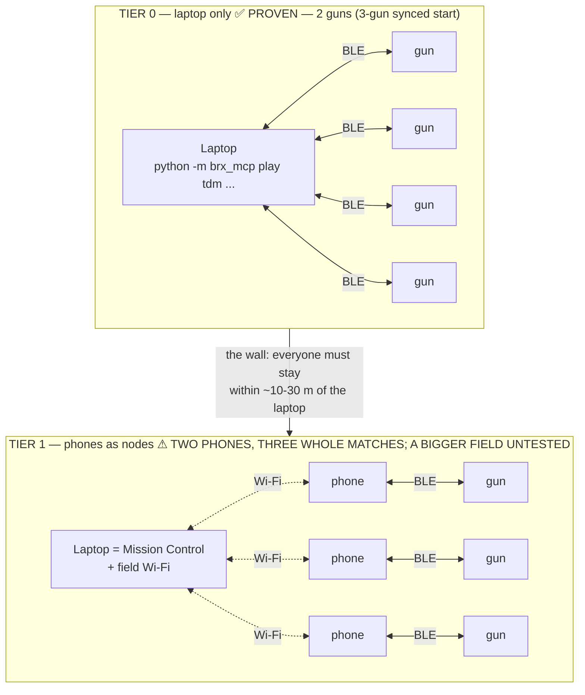
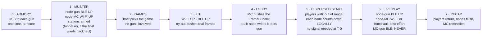
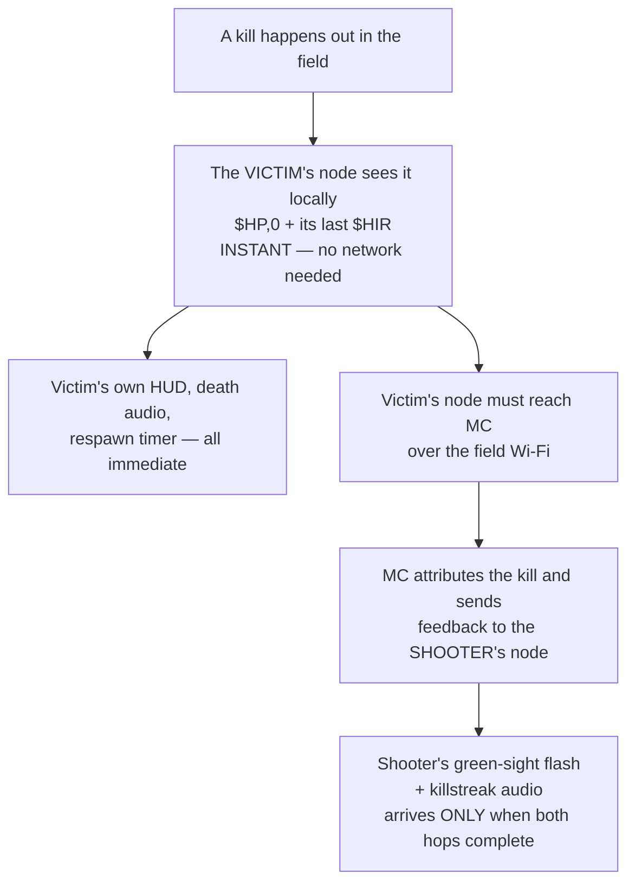

# How Open BRX is wired — topology, limits, and why

**Audience: anyone new to this project** — an owner deciding whether to use it, or a contributor
deciding where their change belongs. Read this before the spec.

Open BRX is not one program. It is **three tiers of hardware that never all talk to each other at
once**, and almost every design decision in this repo follows from that. This page draws the
connections and says why, and it is the one place the link/limit/failure/status detail lives: the
public manual's platform page was cut down to one short page on 2026-09-09 and no longer carries it
(this page's tables and lists below are the same facts, dated and status-marked, moved across from
the old `manual/07-platform.md`).

> **Legend:** ✅ proven on real hardware · ⚠ partly proven · ⬜ specified and software-tested, **not**
> yet run on hardware. The distinction is load-bearing here — see §7.

> **Short answer, if you own taggers and a laptop:** you can play **today**, in one room, with the
> laptop driving the guns directly over BLE — that path is proven on hardware (§3, Tier 0). Phones as
> nodes have played **three whole matches on two phones** (2026-08-30 outdoors, 2026-09-01 outdoors,
> 2026-09-11 on the Mac); a field of more than two phones, a dispersed timed start and recovery from a
> real coverage loss have not been run (§7). The optional **backhaul** (a phone's own data plan reaching
> Mission Control through a tunnel, §2.1) is specified and software-tested only (2026-09-12).

---

## 1. The squeeze — why the architecture looks like this

Every awkward part of this system comes from one trap, set out in
[`adr/0001`](adr/0001-companion-rider-architecture.md) §Context:

The four facts that set the trap, each non-negotiable:

1. **Stock firmware is never modified.** Everything is done over the documented BLE serial
   protocol. (Project hard rule; `CLAUDE.md`.)
2. **The gun is host-blind about its own kills.** It keeps no host-readable game state and emits no
   shooter-side kill event. A kill is visible only from the **victim** (`$HP,0` plus that victim's
   last `$HIR`). So the scorekeeper can never be the gun. (`protocol/brx-protocol.md` §7n; ADR-0001.)
3. **Native feel and host control are mutually exclusive** — until you drive the feel yourself.
   The green-sight flash and killstreak audio *are* BLE-drivable (`$SFLASH` + the token-4 `$PLAY`
   slot), **but only by a host connected to that gun at the instant of the kill.**
4. **The field is offline and dispersed.** Mission Control is a stationary base. Its BLE reaches the
   guns only when players are *at* the base — setup and recap. (ADR-0001 §Context 5.)

---

## 2. Match-time topology

**Solid line = must hold. Dashed line = allowed to drop.** That is the whole resilience model: the
BLE link rides the player and must survive the match; the Wi-Fi link may come and go, and events
queue locally until it returns. Stations (utility phones) are passive beacons once armed and never
connect to anything.

**There is deliberately no line from Mission Control to any gun during play.**

### 2.1 Backhaul — the one optional line (contracts A28, 2026-09-12; ⬜ specified, software-tested, never run on hardware)

The dashed Wi-Fi line is the only thing the field LAN carries: the config push at the lobby, store-and-forward
events, and best-effort feedback. Nothing gameplay-critical rides it, which is exactly why it can be extended
without touching the rest of the shape. **Backhaul** is that extension: Mission Control may expose its **node
socket port, and only that port,** through a tunnel (`cloudflared` quick tunnel: no account, no domain, no
login; or a named tunnel / Tailscale Funnel / port forward via `--public-url`). The join QR then carries **both**
addresses plus a join secret, and a phone that has its own data plan **prefers the public address and falls back
to the LAN**; a phone without one never notices. Nothing is configured on any phone, ever. What it changes:

- a phone with data keeps receiving kill confirms, score, the result and log pulls from wherever it has signal;
- Mission Control **sees which phones are on backhaul** (`NodeView.reach`) and derives **coverage** from it
  instead of asking the operator to assert it: every bound phone on backhaul = full coverage, which makes the
  frag-limit and survival ends authoritative across the whole park (the time limit stays required: a cell
  signal is not a venue assertion);
- a mode may declare that it needs full coverage; none does yet.

What it does **not** change: the laptop still never talks to a gun during play; the field is still an island by
default (the tunnel is opt-in and the laptop needs internet only if the host turns it on); a park with no cell
signal gets nothing extra; kill confirm still needs the victim's phone *and* the shooter's phone to reach MC by
some path. The full contract is `spec/contracts.md` §5d; the join-secret rule (enforced only on hellos that arrive
through the tunnel) is there too. Rejected on the way: a project-run relay service (ADR-0002's cloud backend, again),
and per-phone VPNs (Tailscale on every phone is setup on every phone).

**Every link, and what limits it**

| Link | Transport | Limit | Status |
|---|---|---|---|
| Gun ↔ headset | vendor link | headset must be present or the gun drops BLE entirely | proven, bench |
| **Node (phone) ↔ gun** | **BLE** | **exactly one gun per node**; link must hold all match | proven, single-gun bench |
| Node ↔ Mission Control | Wi-Fi (WebSocket) | best-effort; buffered when down | proven, two phones over field Wi-Fi, three whole matches (2026-08-30, 2026-09-01, 2026-09-11) |
| Node → Mission Control discovery | mDNS `_openbrx._tcp`, or the join QR, or a typed address | mDNS fails on hostile Wi-Fi and some Android stacks; the QR/typed address is the floor | mDNS auto-join proven 2026-09-11 (game test); QR proven |
| **Node ↔ Mission Control, backhaul** | the phone's own data plan → tunnel → the node socket (`wss://`) | opt-in; laptop needs internet; phone needs a plan and signal; same best-effort rules | ⬜ specified 2026-09-12 (A28), software-tested on branch `backhaul-a28`, never run on hardware |
| Operator ↔ Mission Control | HTTP on localhost / LAN | `:8765` UI, `:8766` node socket; the tunnel never exposes `:8765` | run at the 2026-09-11 game test (Mac host) |
| Gun → gun | **IR**, line of sight | the only player-to-player channel | proven |
| Laptop ↔ gun | BLE | **setup and recap only**, never during play (Tier 0 excepted) | proven |
| Laptop ↔ gun | USB | one-time armory setup per gun | proven |

**Counting limits**

| Thing | Limit | Why | Status |
|---|---|---|---|
| Guns per BLE radio | **3 proven**. Three guns held on one laptop radio for a synced start. The maximum is untested | one central radio shares connection events | 3 guns proven (FOLLOWUPS B10), max unmeasured |
| Guns per phone node | **exactly 1** | the link rides one player | by design |
| Players per game | **63** | the gun accepts `$PSET` ids 0–63 (bench-proven); Open BRX reserves wire id 0, so a match has ids 1–63 (`docs/spec/contracts.md` A5.1) | proven |
| Native hardware teams | **4** | `$TID` is masked to 2 bits | proven, bench 2026-08-26 |
| Teams beyond 4 | unlimited *logical* teams | MC scores by roster; players wear armbands; no on-gun friendly-fire protection in that mode | software-tested only |

The wire itself is `spec/contracts.md` §5; the gun↔headset and config-survival facts are
`protocol/session-findings-2026-08.md` §7r; the counting limits are also sourced to
`docs/FOLLOWUPS.md` B10, `docs/spec/contracts.md` A5.1, `protocol/session-findings-2026-08.md` §7p
and `docs/game-modes.md` §Team structure.

---

## 3. Two deployment shapes — and the wall between them

This is the most important practical distinction in the project, and the one most likely to be
misread.

**Tier 0 is real today.** A full Team Deathmatch ran end to end on two real taggers on 2026-08-25 —
scoring, respawn, frag limit, correct winner, BLE holding the whole match
(`experiment-log.md`, "FIRST LIVE M0 GAME"). Three-gun synchronised start is also hardware-proven
(FOLLOWUPS B10). The constraint is that **everyone stays in the laptop's BLE range** — a room, a
yard, a small field.

**Tier 1 is what buys you a real field**, and it is the thinner-tested half. Two phones have played three whole
matches (FFA 2026-08-30 and TDM 2026-09-01 outdoors on a router LAN; a 1v1 game test 2026-09-11 on the Mac, which
found the frag-limit end and the END button broken, F124/F125), a phone respawn station has revived a dead gun
(2026-09-04) and a grenade hill has been captured through the gun (2026-09-10). Not run: more than two phones, a
dispersed timed start, and store-and-forward across a real coverage loss. See §7.

---

## 4. Which links are up, phase by phase

The phase names below are this project's own vocabulary, defined in
[`spec/README.md`](spec/README.md) §3: **armory** = one-time USB setup per gun · **muster** =
everyone connects and reports ready · **games** = the host picks the game · **kit** = assigning numbers,
teams, loadouts · **lobby** = the config is pushed to each gun · a **FrameBundle** is that per-player bundle
of gun commands.

The interesting phase is **5**. The match starts on a wall-clock time agreed in advance, and each
node counts itself down. No "go" signal crosses the field, because at T-0 there may be no network
left to cross it. (`spec/start-sequence.md`.)

---

## 5. The limitation this shape creates

Everything a player experiences *about themselves* is instant and offline. Everything about
**someone else** needs two network hops.

So on a large field, with patchy coverage: **you always know you died. You may not learn you got a
kill until you walk back into range** — or, with backhaul on (§2.1), until both phones next have signal. The
spec calls this "coverage honesty"
([`spec/README.md`](spec/README.md) §2, contracts A4.8) and it is a deliberate trade, not a bug. Since
2026-09-04 the rule is broader (contracts A11.4): the node fires every event its own gun can witness from the
bundle it already holds; MC pushes only what no single gun can know.

Final results are never wrong, only late — kills live in the *victims'* reports, so a scoreboard is
provisional until every node has flushed.

---

## 6. What happens when things break

| Failure | What happens | Status |
|---|---|---|
| Field Wi-Fi drops | Nodes keep playing; events queue locally and flush on return | software-tested only; mid-match resync after a phone crash worked at the 2026-09-11 game test |
| Tunnel dies mid-match (backhaul) | Backhaul phones fall back to the LAN within one reconnect; a restarted quick tunnel has a NEW hostname, so a phone that never reaches the LAN again must rescan the QR | ⬜ software-tested only |
| Laptop loses internet (backhaul) | Every backhaul phone falls back to the LAN; the match never depended on it | ⬜ software-tested only |
| BLE drops mid-match | The node re-probes on reconnect; **the gun's config survives a BLE drop** | proven, bench |
| Gun is power-cycled | Config is **wiped**; a zeroed `$LCD` echo is the node's tell to re-push | proven, bench |
| Phone dies | That player is out. One phone = one gun = one node, with no backup | design |
| Node never returns | Recap stays provisional; that player's kills are missing | design |
| Headset off or asleep | The gun quietly refuses to join. A disconnected headset slow-blinks rainbow, which is a free visual muster check | proven, 2026-08-25 / 27 |

The mechanisms behind each row: `spec/contracts.md` §5a (store-and-forward), `spec/node.md` §3.10
(the live-rejoin reconcile: a 3 s disarmed re-arm that never heals; lobby/armed rejoins re-write the head),
`protocol/session-findings-2026-08.md` §7r (config survives a BLE drop, a power-cycle wipes it, headset off
drops the link).

---

## 7. Proven vs. specified — read this before trusting a diagram

The resolution to trust, in one line: **Tier 0 is proven on two guns; two phones have played three whole matches
(two outdoors on a router LAN, one on the Mac at a 1v1 game test); nobody has run more than two phones, a dispersed
timed start, or store-and-forward recovery across a real outage; backhaul has never touched hardware.** The Companion is spec only; the Utility Box's IR emit is proven from the rig; the
utility *phone* station is built and bench-proven.

**A green test suite is not a working field.** That distinction is stated in FOLLOWUPS B15 in the
project's own words: "a green test ≠ 'works on real guns' — that's earned on the bench."

**Status board**

| Element | Status | Date / evidence |
|---|---|---|
| Remote game start over BLE (config → spawn → live → timed match → respawn) | proven | multiple sessions, 2026-08-23 → 25 |
| Full Team Deathmatch: scoring, respawn, frag limit, correct winner, BLE held all match | proven, 2 guns | 2026-08-25 "FIRST LIVE M0 GAME" |
| Synced start across guns (config-all-then-spawn barrier) | proven, 3 guns | 2026-08-25, FOLLOWUPS B10 |
| Exact per-player attribution over BLE (`$PSET` id → `$HIR` shooter) | proven | 2026-08-25, `protocol/session-findings-2026-08.md` §7p/§7q |
| Native kill feedback from our stack: green-sight flash (`$SFLASH`) + announcer (`$PLAY` slot 4) | proven | 2026-08-25 / 26 |
| Four native teams; firmware-enforced friendly fire; live team flip | proven | 2026-08-26 |
| `$WEAP` map: damage, fire interval, fire modes (auto / single / burst / charge / melee), overheat; all 19 Callsign weapons captured (20 frames) | proven | 2026-08-26 |
| Config survives a BLE drop; a power-cycle wipes it (re-push tell) | proven | 2026-08-25 |
| Headset must be on or the gun won't join; rainbow blink = disconnected | proven | 2026-08-25 / 27 |
| Smart Grenade: 5 native modes, Hill/Respawn beacons readable, no BLE config | proven | exp-log #33–40 |
| BRX IR word decoded (25 bits, timings, parity); **stock tagger accepts synthetic shots from our ESP32 rig** | proven | 2026-08-26 |
| `$SIR` effects matrix (16 protocols × 4 subtypes) mapped: damage, heal, armor, shield, audio suppression | proven | 2026-08-26 / 27 |
| The ×1.25 / ×2 multiplier rows (functions 36 and 37): fn 36 lands the **floor** of magnitude ×1.25, fn 37 lands magnitude ×2 | proven, 16 trials, 4 magnitudes, 8 row-tail shapes, fn 1 control in every trial | 2026-09-02 |
| Native phone app: connects, drives `$SFLASH`, arms a full game, stable session | proven, single gun | 2026-08-25 |
| Phone → Mission Control → gun: hello, roster bind, try-out fired a real gun | proven, single node, bench | 2026-08-25 night |
| Mission Control full stack (Muster → Recap), FrameBundle compiler, operator auth, discovery, loadout policy, saved games | run at a real 1v1 game test on the Mac; the frag-limit end and END were found broken there (F124/F125) | 2026-09-11 game test; ~1,300 Python tests plus the MC e2e suite |
| **Backhaul** (A28): tunnelled node socket, two-URL QR, backhaul-preferred node, derived coverage | ⬜ specified, software-tested on branch `backhaul-a28` | 2026-09-12; FOLLOWUPS B30 is the bench gate |
| FFA / Infection / LMS / CS / Domination / KotH / CTF / Extraction engines | software-tested only | 156 sim scenarios; objective modes wait on a station |
| **MC ↔ two phones over a real field Wi-Fi, a whole match** | proven, 2 phones | 2026-08-30 FFA (300 s, 12 kills), 2026-09-01 outdoor TDM, 2026-09-11 1v1 game test (Mac host, mDNS auto-join); more than two phones untested |
| Grenade as a control point (King of the Hill through the gun, over BLE) | proven | 2026-09-10; MC arms a phone point (F104/S5) |
| **Dispersed timed start on a real field** (players out of range before T-0) | never run | n/a |
| **Store-and-forward recovery after real coverage loss** | never run | n/a |
| 20-minute two-node soak (screen-lock, backgrounding, out of Wi-Fi range) | open | verification-checklist §NEXT 4 |
| Loadout v2 (three slots: primary, secondary, perk; policy presets, phone picks) | software-tested only | 2026-08-27 and 2026-09-04, not bench-verified |
| BRX Companion (ESP32-S3 rider) | specified only | ADR-0001 accepted 2026-08-25; bench kit arrived 2026-08-26 |
| Utility phone station (respawn beacon) armed from MC | proven on hardware, not yet used at a field | 2026-09-04 revive; MC arming merged 2026-09-11 |
| Utility Box / objective station hardware | design; the IR emit side is proven; M5StickS3 kit on order | build is "a packaging exercise" (H7) |
| Effect nodes (relay, WLED, DMX) | specified only | `firmware/` empty |
| Field radio (LoRa / the gun's nRF) | specified only | nRF unprobed (D1) |

**Honest gaps (what is NOT proven yet)**, from `docs/archive/verification-checklist.md`:
- **Mission Control ↔ more than two phones over a real field Wi-Fi**: two phones have played three whole matches (2026-08-30, 2026-09-01, 2026-09-11); larger fleets have not.
- **Backhaul (A28)**: never on hardware. The gate is one Pixel with Wi-Fi off and data on, joining through a quick tunnel and receiving a kill confirm (B30).
- **A dispersed timed start on a real field** (players out of range before T-0): never run.
- **Store-and-forward recovery after real coverage loss**: never run.
- **20-minute two-node soak** with a screen-lock and a backgrounding, out of Wi-Fi range: open.
- **Phone auto-rejoin** to a no-internet SSID after walking out of range: open, per OS.
- **iOS locked-phone BLE**: do queued hits reach the engine on resume? Open.
- **Hold-across-disperse**: a 2-minute hold is proven. The 5-minute run was interrupted and needs a re-run.
- **Guns per BLE radio**: three held at once is the proven figure. The maximum has not been measured.
- **FFA / Infection / LMS on real guns**: the logic is sim-proven (156 scenarios). On-gun LED colours, sounds, health and scoreboard are not yet confirmed live. The attribution fuse is not exercised.
- **Objective modes (Domination / KotH / CTF / CS / Extraction) live**: the engines wait on a station or grenade to emit the IR events. Grenade CTF team-assign (G9) and thrown-blast `$GREN` (G10) are open.
- **Health variants live** (Syphon, regen): `$LIFE` writes are confirmed, but the modes on top are not run live. The shield pool is IR-only (fn-11), and the node/app currently drop the shield token (Q12). A hit fully absorbed by a shield would go unreported.
- **Config knobs on-gun**: outdoor mode, kid mode, volume levels, HP/armor start values; none flipped on the bench yet. (Night-mode LEDs-off is **done**: we ship Callsign's own frame `$GLED,,,,5,,,*`, verified 2026-08-30. It blanks all three body LEDs because its colour tokens are empty and token 4 = 5 applies them, which was measured 2026-09-02.)
- **Loadout v2** (three slots: primary, secondary and a perk of its own; policy presets, phone picks): built 2026-08-27 and 2026-09-04, not bench-verified.
- **Melee in a compiled game**: it did not work on the bench, even though our frames match Callsign's byte for byte (K4). A runtime or state question.
- **ADR-0001 confirmation still owed**: that a host-armed game does *not* self-fire feedback once disconnected.
- **Companion**: not built. Open items are the pairing/binding handshake, the mount (needs caliper measurements), the OTA flow, Wi-Fi + BLE coexistence, and the ESP-NOW mesh end to end.
- **Utility Box**: emit is proven from the rig. The box itself is not built (enclosure, captive web config, ESP-NOW/LoRa coordination, IR range at each drive level, capture debounce). Station-arming persistence for respawn (B12) is open.
- **Effect nodes**: no firmware. Music and stingers from the laptop are untested beyond design.
- **Field radio / nRF**: the gun's built-in nRF is unprobed (D1). LoRa-standard adoption (D2) comes from community measurements, not ours.
- **Gen 1 taggers** (Bluetooth Classic): unsupported. Guide to do.
- **MacBook holds a BRX link**: prior sessions worked. Re-confirm before match day.
- **Objective callout sound ids**: provisional (a by-ear session is needed). Medal and streak ids beyond "kill" are not yet heard on the bench.

---

## 8. What each budget buys

Starting inventory assumed: 4 BRX taggers (+ headsets), 2 Smart Grenades, and a laptop or phone you
already own. No mods, no builds, no purchases required beyond Tier 0.

- **Tier 0 — $0, exactly what you own** (proven): a laptop in BLE range drives the guns directly, so
  a room, a yard or a small field works. Setup, start, spawn, live hit/death tracking, host-driven
  respawn and a synced start are proven. TDM is proven; FFA / Infection / LMS engines and the laptop
  scoreboard are software-tested only. Custom weapons (`$WEAP`: damage, rate, mag, reload type,
  per-fire sounds; all 19 Callsign weapons captured and rebalanced), diagnostics, and custom
  on-tagger sound packs over USB are proven. Grenade objectives (Hill / Respawn / Assault / CTF / CS
  bomb) are proven, with CTF team-assign still open. Limit: everyone stays in the laptop's BLE range,
  and there is no per-player HUD.
- **Tier 1 — old Android/iOS phones as nodes, ~$0 if you have them (else ~$30–50 used)**: the biggest
  jump in capability for the least money, because the link rides the player. Full-field roaming for
  every Tier-0 mode, a per-player HUD, offline play with results syncing at the base. Native app on
  Android + iOS (ADR-0003), one phone per gun. Two phones have run two whole matches on real hardware
  outdoors (2026-08-30, 2026-09-01) and a third on the Mac (2026-09-11); more than two phones is untested.
  **Optional, ~$0–50 more:** internet at the laptop (a SIM travel router, or tether it) turns on **backhaul**
  (§2.1): any player phone with a data plan then reaches Mission Control from anywhere it has signal, with
  nothing to set up on the phone (specified 2026-09-12, not yet on hardware).
- **Tier 2 — ESP32 Companion per tagger, ~$12–25 each** (specified, not built): a purpose-built,
  rugged, phone-free node that rebuilds the native kill flash and audio. Power-ups (extra life,
  faster fire, damage boost, shields) as decoded command sequences. ESP-NOW mesh between Companions
  for instant field-wide kill-confirm. Optional +$5–7 loud custom audio, +$8–12 on-gun HUD.
- **Tier 3 — objective stations, ~$5–15 each (+ paper QR ~$0)** (design stage; IR emit proven):
  Domination (multi-point + live scoreboard), KotH, CTF variants, Assault, Extraction point, bomb
  site, respawn stations (data-mule sync). Grenades cover single-objective modes for $0; stations are
  for multi-point play, live ownership and scoring, and respawn.
- **Tier 4 — field radio, LoRa ~$10/node (or the gun's own nRF, unprobed, maybe free)** (specified
  only): live coordination on a large park with no Wi-Fi — "flag taken!" broadcast, live HQ
  scoreboard, station status screens, Battle Royale.

---

## Where to go next

- **You own guns and want to play** → §8 above for what each budget buys, then the `brx-mcp`
  quickstart in the [root README](../README.md).
- **You're running a match** → [`field-runbook-mc.md`](field-runbook-mc.md).
- **You're changing the code** → [`spec/README.md`](spec/README.md), then
  [`spec/contracts.md`](spec/contracts.md).
- **You want to know why, not what** → the three ADRs in [`adr/`](adr/).
